### 基础环境准备

+ 在VM中克隆出一个新的虚拟机，IP地址为192.168.XX.XX

  + 对虚拟机进行完整克隆，通过网络适配器生成新的mac地址

    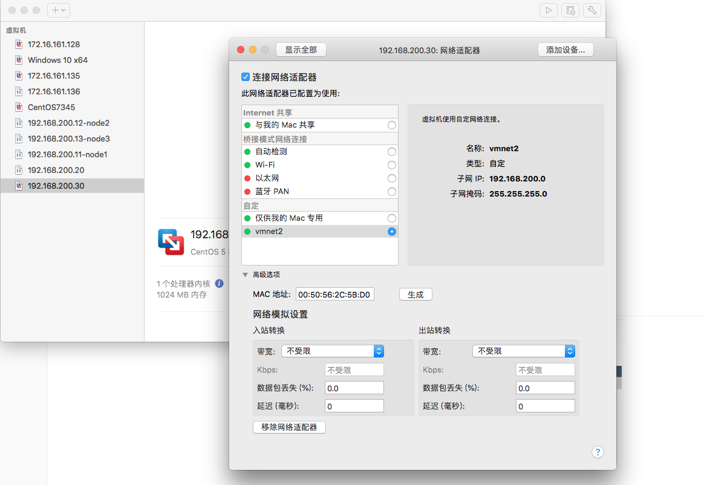

  + 修改网络配置文件更改本机ip，重启网络服务使配置生效

    

+ 在Docker中安装MySQL容器，端口映射到宿主机

  + 安装docker

    ```shell
    yum install docker
    ```

  + 更换docker镜像进行加速

    ```shell
    vim /etc/docker/daemon.json
    # 地址通过阿里云->容器镜像服务->镜像加速器申请，每个人都有！
    
    sudo systemctl daemon-reload
    sudo systemctl restart docker
    ```

  + md，怎么没有docker但是环境都配的差不多了，甚至还能找到之前的镜像和容器？？？

  + mysql镜像下载以及容器创建端口映射

    ```shell
    docker pull  mysql:5.7
    docker run -di --name=mysql -p 3307:3306 -v /root/mysql/logs:/logs -v /root/mysql/data:/var/lib/mysql -e MYSQL_ROOT_PASSWORD=123456 mysql:5.7
    ```

+ 在Docker中安装ElasticSerach容器，端口映射到宿主机

  + 再https://hub.docker.com/上搜索elasticsearch然后去服务器上pull就好

  + 该网站可能访问不会太快可以在https://www.ping.cn/dns上找一下比较快的ip配置一下hosts文件提个速

  + 

  + 创建守护式容器，进行端口映射

    ```shell
    docker run -di --name=elasticsearch -p 9200:9200 -p 9300:9300 elasticsearch:latest
    ```

  + 访问接口查看是否启动

    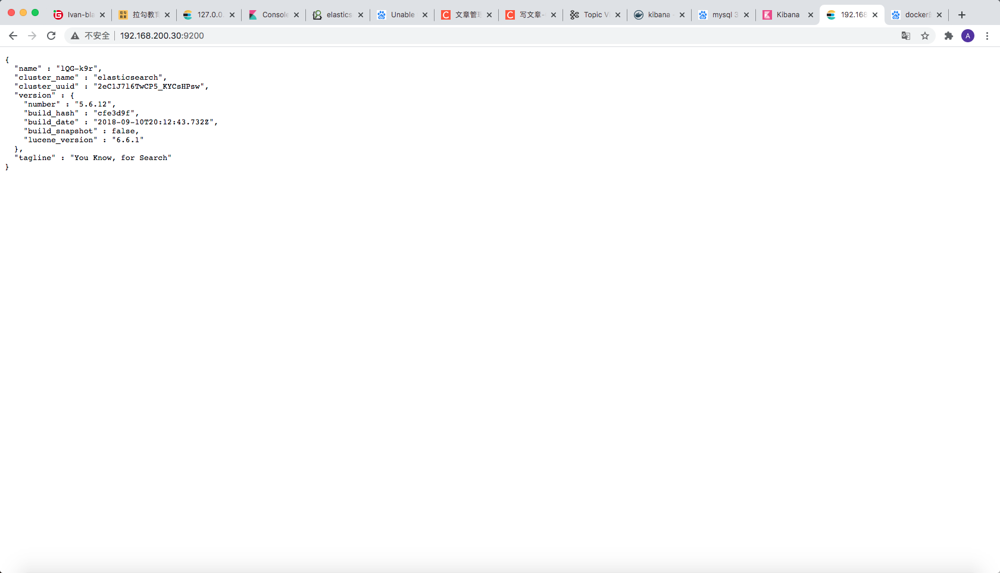

+ 在Docker中安装Kibanna容器，配置ES的URL地址，端口映射到宿主机

  + 同去hub上找一个pull

  + 然后pull完了一顿操作

    ```shell
    docker pull kibana
    docker run -di --name=kibana -p 5601:5601 kibana:latest
    ```

  + 本机登陆http://192.168.200.30:5601/看看

  + 发现elasticsearch状态不对

  + 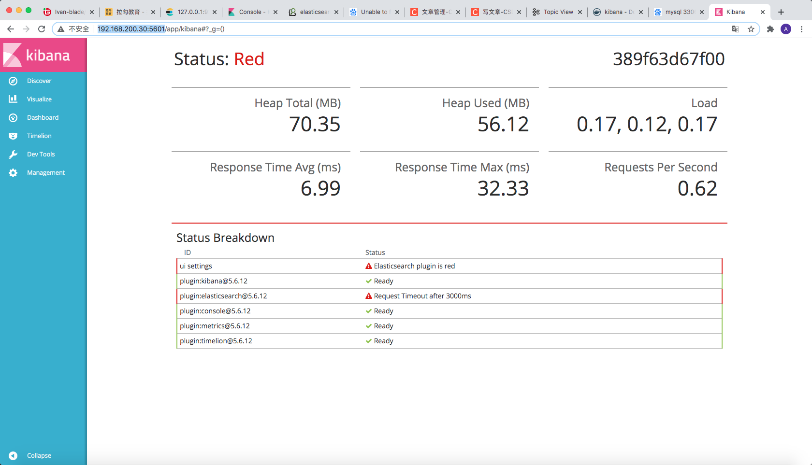

  + 第一个错误不看，第三个错误应该是需要修改一下记录elastic接口的配置文件，等着我去百度一下

  + 我们删除一下之前的容器然后修改一下创建容器的shell试试

  + ```shell
    docker run -id -e ELASTICSEARCH_URL=http://192.168.200.30:9200 --name=kibana -p 5601:5601 kibana:latest
    ```

  + md,还是报错

    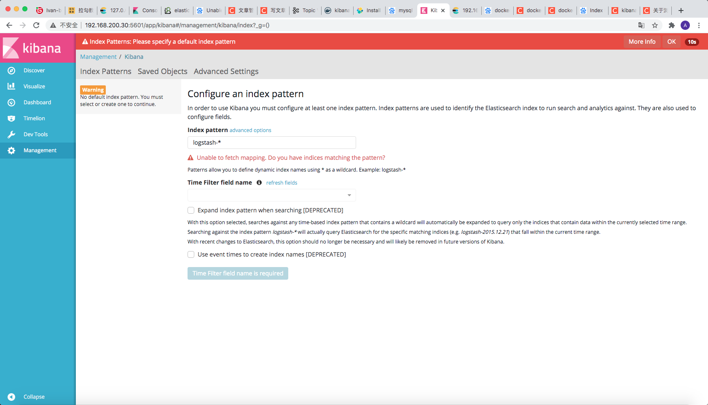

  + 好像是版本问题，只好干掉两个镜像，加上版本了

  + 完美，elastic访问不了了。。。。算了算了，换个方式做做吧，虚拟机删了，这次用docker-compose方式安装

  + 首先安装compose

    ```shell
    curl -L https://get.daocloud.io/docker/compose/releases/download/1.8.0/run.sh > /usr/local/bin/docker-compose
    chmod +x /usr/local/bin/docker-compose
    ```

  + 重装了一下发现es又行了。。。上面的报错好像不影响使用，毕竟es没有报错，好，就这样

  + 好家伙es又挂掉了，通过命令查看是内存分配不够，需要重新创建一下容器

    ```shell
    docker logs -f elasticsearch #查看容器日志
    docker run -di --name elasticsearch -p 9200:9200 -p 9300:9300 -e ES_JAVA_OPTS="-Xms64m -Xmx128m" elasticsearch:latest
    
    # 哦豁，它又行了，不愧是我
    ```

  + 准备装个ik发现latest版本居然是5.x。。。都找不到ik版本，卸了重来

    ```shell
    docker pull elasticsearch:6.8.13
    docker run -di --name elasticsearch -p 9200:9200 -p 9300:9300 -e ES_JAVA_OPTS="-Xms64m -Xmx128m" elasticsearch:6.8.13
    docker pull kibana:6.8.13
    docker run -id -e ELASTICSEARCH_URL=http://192.168.200.30:9200 --name=kibana -p 5601:5601 kibana:6.8.13
    
    # 创建之后es又挂了，日志是个好东西
    docker logs -f elasticsearch
    # max virtual memory areas vm.max_map_count [65530] is too low, increase to at least [262144]
    # 报错如上，编辑一下
    vi /etc/sysctl.conf
    vm.max_map_count=262144
    # 重启生效，发现并没有软用。。。因为我改的是虚拟机内存，es部署在容器里，生成容器时改一下配置看看
    docker rm elasticsearch
    docker run -di --name elasticsearch -p 9200:9200 -p 9300:9300 -e ES_JAVA_OPTS="-Xms512m -Xmx512m" elasticsearch:6.8.13
    # 完美，不愧是我,这次安装完kibana也没有问题了，舒服，开始安装ik，因为不能直接从github下载所以我用了资源代下网站，更换了地址
    docker exec -it elasticsearch /bin/bash
    ./bin/elasticsearch-plugin install https://dl2.serctl.com/downloads6/2021-02-03-14-07-36-download-elasticsearch-analysis-ik-6.8.13.zip
    # 日又特么报错，没一步是顺的
    -> Downloading https://dl2.serctl.com/downloads6/2021-02-03-14-07-36-download-elasticsearch-analysis-ik-6.8.13.zip
    [=================================================] 100%?? 
    Exception in thread "main" java.lang.IllegalStateException: duplicate plugin: - Plugin information:
    Name: analysis-ik
    Description: IK Analyzer for Elasticsearch
    Version: 6.8.13
    Elasticsearch Version: 6.8.13
    Java Version: 1.8
    Native Controller: false
    Extended Plugins: []
     * Classname: org.elasticsearch.plugin.analysis.ik.AnalysisIkPlugin
     	at org.elasticsearch.plugins.PluginsService.readPluginBundle(PluginsService.java:405) ~[elasticsearch-6.8.13.jar:6.8.13]
    	at org.elasticsearch.plugins.PluginsService.findBundles(PluginsService.java:386) ~[elasticsearch-6.8.13.jar:6.8.13]
    	at org.elasticsearch.plugins.PluginsService.getPluginBundles(PluginsService.java:379) ~[elasticsearch-6.8.13.jar:6.8.13]
    # 看样子是直接安装有问题，只能下载压缩包之后手动挡解压了
    curl -f https://dl2.serctl.com/downloads6/2021-02-03-14-07-36-download-elasticsearch-analysis-ik-6.8.13.zip -o /usr/share/elasticsearch/plugins/ik.zip
    cd /plugins
    mkdir ik/
    mv ik.zip ./ik
    cd ik/
    unzip ik.zip
    rm ik.zip
    exit
    docker restart elasticsearch
    # md，重启直接es直接宕机，查看日志报错同上，看样子是插件有问题啊。。。有问题没办法啊？？？我这能怎么办？
    # 试试离线安装将zip文件移动到创建的新目录tempS中（不能放在plugins里会报另外的错误），果然没有软用。。。这个报错好奇怪啊
    ./elasticsearch-plugin install file:/usr/share/elasticsearch/tempS/ik.zip 
    
    ### 不干了，不要中文了,重下一次给它最后一次机会
    curl -f https://dl2.serctl.com/downloads6/2021-02-03-14-07-36-download-elasticsearch-analysis-ik-6.8.13.zip -o /usr/share/elasticsearch/tempS/elasticsearch-analysis-ik-6.8.13.zip
    unzip elasticsearch-analysis-ik-6.8.13.zip
    mv elasticsearch-analysis-ik-6.8.13.zip elasticsearch-analysis-ik-6.8.13.zip.bake
    
    ### 谷歌翻译了一下那个错误，重复的插件。。。很可能是一开始安装过重启会宕机，然后我趁没宕机的时候删除了plugins下的文件，所以不能继续安装,直到上面最后一步，我重启之后插件就能加载好了，好像插件不需要安装在plugins目录下，网上也提到过新版本es插件不要安装在该目录下，换一个目录，我的插件解压在了tempS目录下，记得删除或者重命名压缩包，不然会报错
    ```

    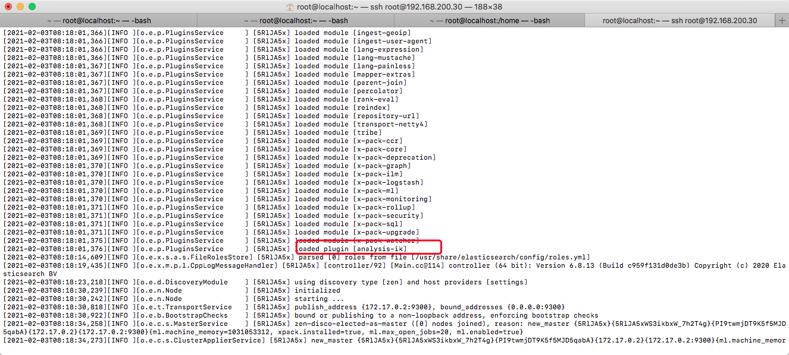

+ 在Centos7中创建集群网络，192.168.0.0/24  命名为：kafka

  ```shell
  #创建
  docker network create --driver bridge --subnet 192.168.0.0/24 --gateway 192.168.0.1 kafka 
  #查看
  docker network ls
  ```

+ 在Docker中搭建Zookeeper集群

+ 在Docker中搭建Kafka集群

+ 在Docker中安装Kafka-Manager，端口映射到宿主机

+ 在home目录下编辑如下三个文件

  + docker-compose-zookeeper.yml

    ```shell
    version: '2'
    
    
    services:
      zoo1:
        image: zookeeper:3.4
        restart: always
        hostname: zoo1
        container_name: zoo1
        ports:
        - 2184:2181
        environment:
          ZOO_MY_ID: 1
          ZOO_SERVERS: server.1=zoo1:2888:3888 server.2=zoo2:2888:3888 server.3=zoo3:2888:3888
        networks:
          kafka:
            ipv4_address: 192.168.0.11
    
    
      zoo2:
        image: zookeeper:3.4
        restart: always
        hostname: zoo2
        container_name: zoo2
        ports:
        - 2185:2181
        environment:
          ZOO_MY_ID: 2
          ZOO_SERVERS: server.1=zoo1:2888:3888 server.2=0.0.0.0:2888:3888 server.3=zoo3:2888:3888
        networks:
          kafka:
            ipv4_address: 192.168.0.12
    
    
      zoo3:
        image: zookeeper:3.4
        restart: always
        hostname: zoo3
        container_name: zoo3
        ports:
        - 2186:2181
        environment:
          ZOO_MY_ID: 3
          ZOO_SERVERS: server.1=zoo1:2888:3888 server.2=zoo2:2888:3888 server.3=0.0.0.0:2888:3888
        networks:
          kafka:
            ipv4_address: 192.168.0.13
    
    
    networks:
      kafka:
        external:
          name: kafka
    ```

    

  + docker-compose-kafka.yml

    ```shell
    version: '2'
    
    
    services:
      kafka1:
        image: wurstmeister/kafka
        restart: always
        hostname: kafka1
        container_name: kafka1
        privileged: true
        ports:
        - 9092:9092
        environment:
          KAFKA_ADVERTISED_HOST_NAME: kafka1
          KAFKA_LISTENERS: PLAINTEXT://kafka1:9092
          KAFKA_ADVERTISED_LISTENERS: PLAINTEXT://kafka1:9092
          KAFKA_ADVERTISED_PORT: 9092
          KAFKA_ZOOKEEPER_CONNECT: zoo1:2181,zoo2:2181,zoo3:2181
        external_links:
        - zoo1
        - zoo2
        - zoo3
        networks:
          kafka:
            ipv4_address: 192.168.0.14
    
    
      kafka2:
        image: wurstmeister/kafka
        restart: always
        hostname: kafka2
        container_name: kafka2
        privileged: true
        ports:
        - 9093:9093
        environment:
          KAFKA_ADVERTISED_HOST_NAME: kafka2
          KAFKA_LISTENERS: PLAINTEXT://kafka2:9093
          KAFKA_ADVERTISED_LISTENERS: PLAINTEXT://kafka2:9093
          KAFKA_ADVERTISED_PORT: 9093
          KAFKA_ZOOKEEPER_CONNECT: zoo1:2181,zoo2:2181,zoo3:2181
        external_links:
        - zoo1
        - zoo2
        - zoo3
        networks:
          kafka:
            ipv4_address: 192.168.0.15
    
    
      kafka3:
        image: wurstmeister/kafka
        restart: always
        hostname: kafka3
        container_name: kafka3
        privileged: true
        ports:
        - 9094:9094
        environment:
          KAFKA_ADVERTISED_HOST_NAME: kafka3
          KAFKA_LISTENERS: PLAINTEXT://kafka3:9094
          KAFKA_ADVERTISED_LISTENERS: PLAINTEXT://kafka3:9094
          KAFKA_ADVERTISED_PORT: 9094
          KAFKA_ZOOKEEPER_CONNECT: zoo1:2181,zoo2:2181,zoo3:2181
        external_links:
        - zoo1
        - zoo2
        - zoo3
        networks:
          kafka:
            ipv4_address: 192.168.0.16
    
    
    networks:
      kafka:
        external:
          name: kafka
    
    ```

    

  + docker-compose-manager.yml

    ```shell
    version: '2'
    
    
    services:
      kafka-manager:
        image: sheepkiller/kafka-manager:latest
        restart: always
        container_name: kafka-manager
        hostname: kafka-manager
        ports:
         - 9000:9000
        environment:
         ZK_HOSTS: zoo1:2181,zoo2:2181,zoo3:2181
         KAFKA_BROKERS: kafka1:9092,kafka2:9092,kafka3:9092
         APPLICATION_SECRET: letmein
         KM_ARGS: -Djava.net.preferIPv4Stack=true
        networks:
         kafka:
          ipv4_address: 192.168.0.17
    
    
    
    
    networks:
      kafka:
        external:
          name: kafka
    ```

    

  ```shell
  docker pull zookeeper:3.4
  docker pull wurstmeister/kafka
  docker pull sheepkiller/kafka-manager:latest
  
  docker-compose -f /home/docker-compose-zookeeper.yml up -d
  docker-compose -f /home/docker-compose-kafka.yml up -d
  docker-compose -f /home/docker-compose-manager.yml up -d
  ```

+ 登陆http://192.168.200.30:9000/添加集群修改如下配置

  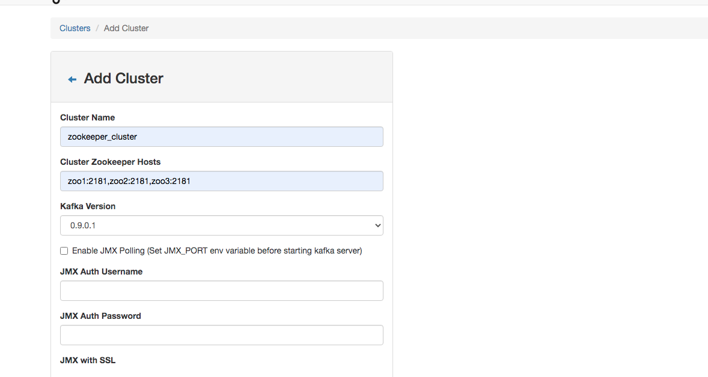

  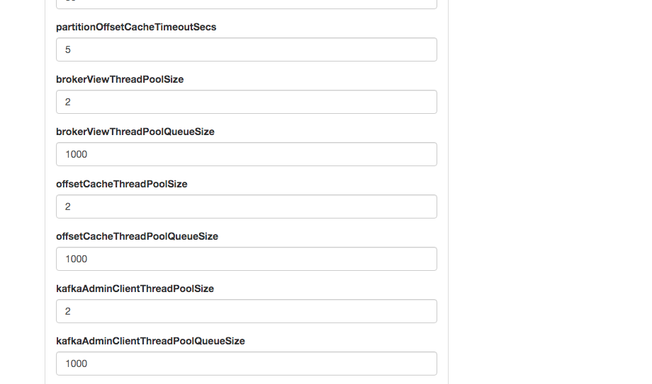

  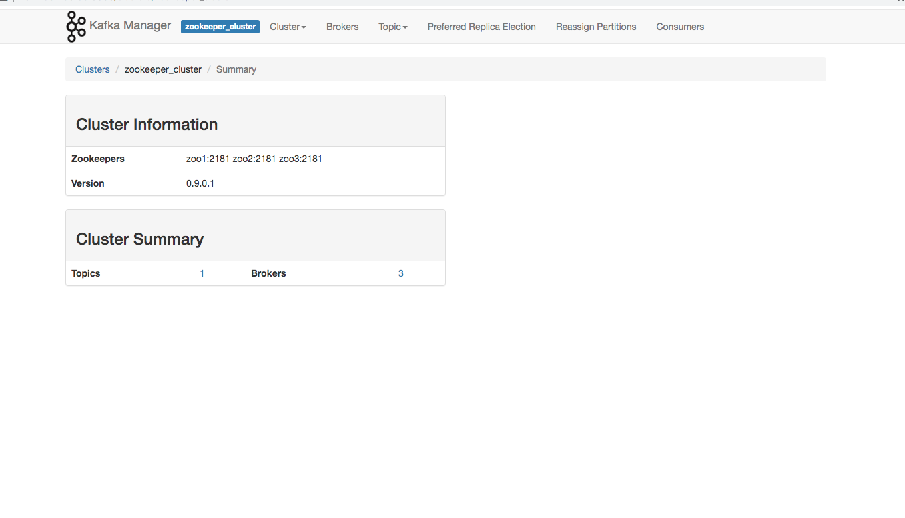

+ 登录到Kafka容器，创建主题：product，3个三区，3个副本

  ```shell
  kafka-topics.sh --create --zookeeper zoo1:2181 --replication-factor 3 --partitions 3 --topic product
  ```

  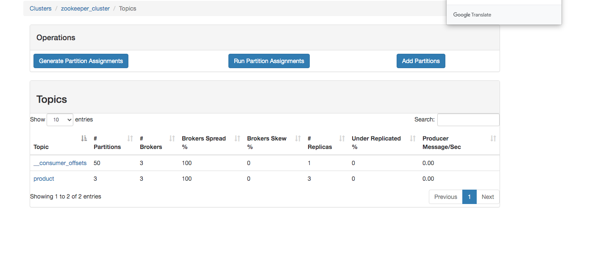

### 索引库准备

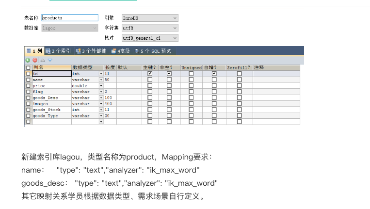

+ 数据库准备

  ```sql
  create database lagou;
  use lagou;
  
  drop table if exists products;
  create table if not exists products(
  	id int(11) not null primary key auto_increment,
    name varchar(50) default null,
    price double default 0,
    flag varchar(2),
    goods_Desc varchar(100),
    images varchar(400),
    goods_Stock int(11),
    goods_Type varchar(20)
  ) ENGINE=InnoDB DEFAULT CHARSET=utf8;
  ```

+ 索引库生成（我们这边采用spring-data-elasticsearch自动生成）

  + 引入依赖

    ```xml
    <dependency>
        <groupId>org.springframework.boot</groupId>
        <artifactId>spring-boot-starter-data-elasticsearch</artifactId>
    </dependency>
    ```

  + 配置yml

    ```yml
    spring:
      data:
        elasticsearch:
          cluster-name: docker-cluster
          cluster-nodes: 192.168.200.30:9300
    ```

  + 编写创建索引和映射方法

    ```java
    @RunWith(SpringRunner.class)
    @SpringBootTest
    public class InitTest {
    
    
        @Autowired
        private ElasticsearchTemplate template;
    
        @Test
        public void createIndex() {
            template.createIndex(Products.class);
        }
    
        @Test
        public void createType() {
            template.putMapping(Products.class);
        }
    }
    ```

    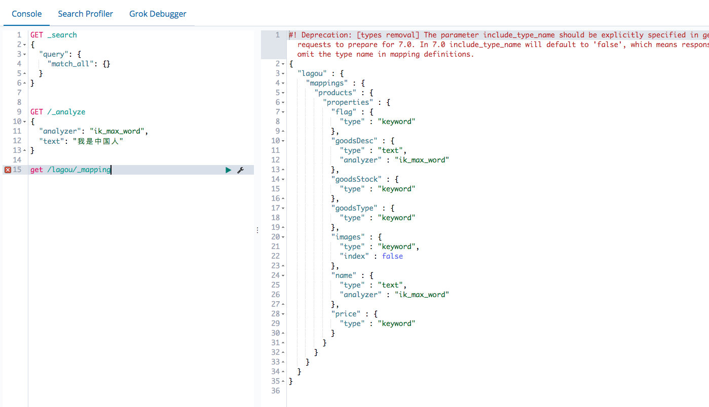

    + kinaba创建映射的方式

      ```js
      put /test
      put /test/_mapping/nothing 
      {
        "properties" : {
              "flag" : {
                "type" : "keyword"
              },
              "goodsDesc" : {
                "type" : "text",
                "analyzer" : "ik_max_word"
              },
              "goodsStock" : {
                "type" : "keyword"
              },
              "goodsType" : {
                "type" : "keyword"
              },
              "images" : {
                "type" : "keyword",
                "index" : false
              },
              "name" : {
                "type" : "text",
                "analyzer" : "ik_max_word"
              },
              "price" : {
                "type" : "keyword"
              }
            }
      }
      ```

      

### 项目需求

#### 新增商品

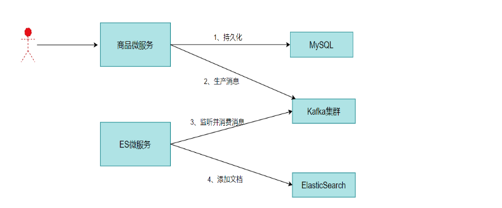

+ 流程说明

  1、持久化：商品微服务将用户传入的商品信息封装为商品对象持久化到数据库

  2、生产消息：商品微服务将商品对象保存后，获得该商品对象在数据库中记录的id，将该id作为消息发送到Kafka的product主题中

  3、监听并消费消息：ES微服务监听Kafka的product主题，收到新消息（新插入商品的id）后，从数据库中查询该id对象的商品对象

  4、添加文档：ES微服务将通过id查询到的商品对象，添加到Elasticsearch的lagou索引库中。

+ 设计

  + 商品模块设计商品信息保存接口
    + 使用mybatis-plus的insert语句，注意加上TableID注解，mysql-plus会将id封存到controller层传入的对象当中
    + 

#### 商品查询


+ 需求描述
  +  实现商品查询功能，类似电商站内商品搜索
    - 查询条件：name
    - 分页查询：每页5条
    - 排序规则：price，升序
    - 结果过滤：商品价格范围过滤
    - 实现高亮效果

